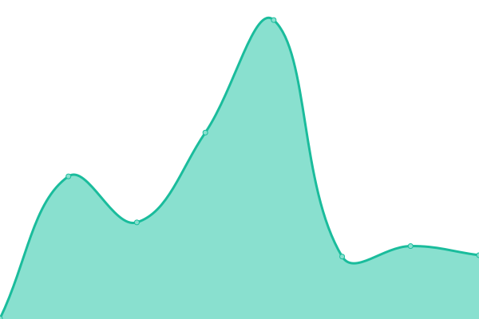
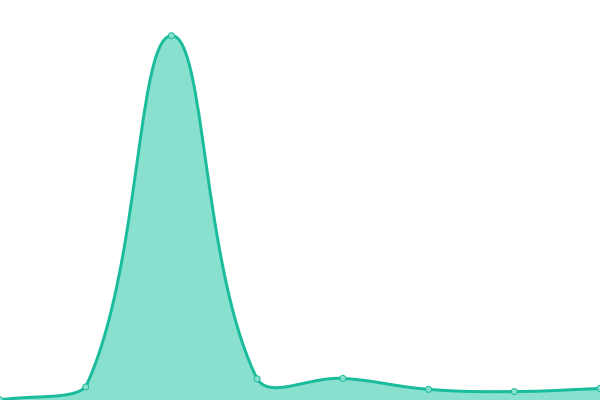
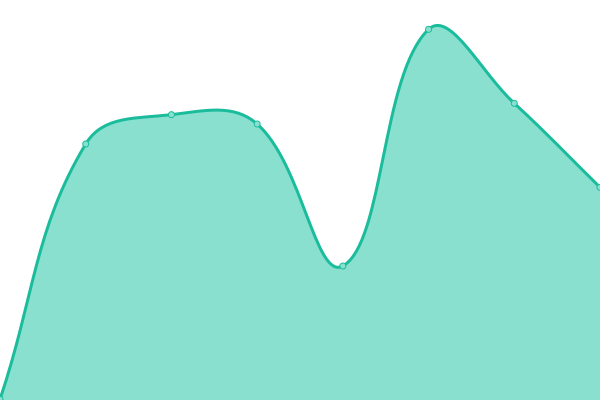

# [📈 Live Status](https://AlanViotto.github.io/status): <!--live status--> **🟩 All systems operational**

This repository contains the open-source uptime monitor and status page for [Alan Viotto](https://AlanViotto.github.io/status), powered by [Upptime](https://github.com/upptime/upptime).

With [Upptime](https://upptime.js.org), you can get your own unlimited and free uptime monitor and status page, powered entirely by a GitHub repository. We use [Issues](https://github.com/AlanViotto/status/issues) as incident reports, [Actions](https://github.com/AlanViotto/status/actions) as uptime monitors, and [Pages](https://AlanViotto.github.io/status) for the status page.

<!--start: status pages-->
<!-- This summary is generated by Upptime (https://github.com/upptime/upptime) -->
<!-- Do not edit this manually, your changes will be overwritten -->
<!-- prettier-ignore -->
| URL | Status | History | Response Time | Uptime |
| --- | ------ | ------- | ------------- | ------ |
|  [🚀 Portal Produção](https://portal.dialab.ai) | 🟩 Up | [portal-producao.yml](https://github.com/AlanViotto/status/commits/HEAD/history/portal-producao.yml) | 

 282ms
     
 | 

<a href="https://alanviotto.github.io/status/history/portal-producao">99.23%</a>
    

|  [🛠️ Portal Staging](https://portal-dialab.webflow.io) | 🟩 Up | [portal-staging.yml](https://github.com/AlanViotto/status/commits/HEAD/history/portal-staging.yml) | 

 262ms
     
 | 

<a href="https://alanviotto.github.io/status/history/portal-staging">100.00%</a>
    

|  [🧠 API Inteligencia de Vida](https://api.login.inteligenciadevida.tec.br/api/Client) | 🟩 Up | [api-inteligencia-de-vida.yml](https://github.com/AlanViotto/status/commits/HEAD/history/api-inteligencia-de-vida.yml) | 

 292ms
     
 | 

<a href="https://alanviotto.github.io/status/history/api-inteligencia-de-vida">100.00%</a>
    

|  📦 Banco Supabase Prod | 🟩 Up | [banco-supabase-prod.yml](https://github.com/AlanViotto/status/commits/HEAD/history/banco-supabase-prod.yml) | 

 333ms
     
 | 

<a href="https://alanviotto.github.io/status/history/banco-supabase-prod">100.00%</a>
    

|  🧪 Banco Supabase Staging | 🟩 Up | [banco-supabase-staging.yml](https://github.com/AlanViotto/status/commits/HEAD/history/banco-supabase-staging.yml) | 

 333ms
     
 | 

<a href="https://alanviotto.github.io/status/history/banco-supabase-staging">100.00%</a>
    

<!--end: status pages-->

[**Visit our status website →**](https://AlanViotto.github.io/status)

## 📄 License

- Powered by: [Upptime](https://github.com/upptime/upptime)
- Code: [MIT](./LICENSE) © [Anand Chowdhary](https://anandchowdhary.com), supported by [Pabio](https://pabio.com)
- Data in the `./history` directory: [Open Database License](https://opendatacommons.org/licenses/odbl/1-0/)
